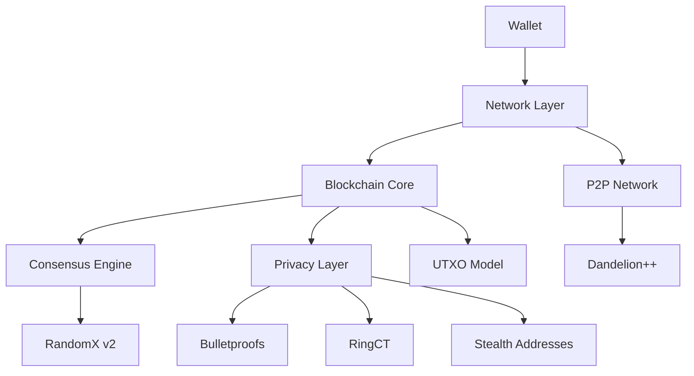

# DarkGhost Architecture Overview

This document provides a high-level overview of the DarkGhost system architecture.

## Overview

DarkGhost is a hybrid cryptocurrency that combines Bitcoin's UTXO model with Monero's privacy features. The architecture is designed for scalability, security, and privacy.

## System Components

### 1. Core Blockchain Layer

#### UTXO Model
- **Unspent Transaction Outputs**: Bitcoin-style UTXO model for efficient transaction processing
- **Fixed Supply**: 100 million DG tokens with no inflation
- **Fast Blocks**: 2-minute block time for rapid transaction confirmation
- **Dynamic Sizing**: Blocks automatically adjust size based on network demand

#### Block Structure
```
Block Header:
- Version: Protocol version
- Previous Block Hash: Hash of previous block
- Merkle Root: Root of transaction Merkle tree
- Timestamp: Block creation time
- Difficulty Bits: Current difficulty target
- Nonce: Value for PoW solution

Block Body:
- Transaction List: List of transactions in the block
- Privacy Metadata: Ring signatures, Bulletproofs, etc.
```

#### Consensus Mechanism
- **RandomX v2**: CPU-friendly, ASIC-resistant mining algorithm
- **Proof of Work**: Secure and decentralized consensus mechanism
- **Difficulty Adjustment**: Maintains consistent 2-minute block intervals

### 2. Privacy Layer

#### Ring Confidential Transactions (RingCT)
- **Ring Signatures**: Mix real inputs with decoy inputs
- **Pedersen Commitments**: Hide transaction amounts
- **Default Ring Size**: 11 (10 decoys + 1 real)

#### Bulletproofs
- **Range Proofs**: Efficient proofs that amounts are positive
- **Size Reduction**: Compress transaction data by ~80%
- **Fast Verification**: Optimized verification algorithms

#### Stealth Addresses
- **One-time Addresses**: Generate unique addresses for each transaction
- **View Keys**: Allow recipients to scan for incoming transactions
- **Spend Keys**: Authorize spending of received funds

### 3. Network Layer

#### Peer-to-Peer Network
- **Node Discovery**: Bootstrap nodes and peer discovery
- **Message Propagation**: Transaction and block propagation
- **Connection Management**: Peer connection handling
- **Dandelion++**: Privacy-enhanced transaction propagation

#### Network Protocols
- **P2P Protocol**: Node-to-node communication
- **RPC Interface**: Remote procedure calls for wallet integration
- **Stratum Protocol**: Mining pool communication
- **ZMQ Interface**: Event notification system

### 4. Wallet Layer

#### CLI Wallet
- **Key Management**: Secure generation and storage of keys
- **Transaction Creation**: Create privacy-enhanced transactions
- **Balance Tracking**: Monitor wallet balances
- **Address Generation**: Create stealth addresses

#### GUI Wallet (Planned)
- **User Interface**: Graphical interface for wallet operations
- **Multi-platform**: Windows, macOS, and Linux support
- **Hardware Wallet**: Integration with Ledger and Trezor
- **Mobile Wallet**: Android and iOS applications

### 5. Application Layer

#### Block Explorer
- **Transaction Lookup**: Search and view transaction details
- **Block Navigation**: Browse blockchain blocks
- **Address Tracking**: Monitor address activity
- **Network Statistics**: View network metrics

#### Mining Pool
- **Stratum Server**: Mining protocol implementation
- **Reward Distribution**: Fair reward distribution to miners
- **Statistics Tracking**: Miner performance tracking
- **Pool Management**: Administrative interface

## Data Flow

### Transaction Processing
1. **Transaction Creation**: Wallet creates RingCT transaction
2. **Privacy Enhancement**: Add Bulletproofs and stealth addresses
3. **Network Broadcast**: Transaction broadcast to P2P network
4. **Validation**: Nodes validate transaction privacy and correctness
5. **Mempool**: Transaction enters memory pool
6. **Block Inclusion**: Miner includes transaction in block
7. **Block Propagation**: New block broadcast to network
8. **Confirmation**: Transaction receives confirmations

### Block Processing
1. **Block Reception**: Node receives new block
2. **Header Validation**: Validate block header and PoW
3. **Transaction Validation**: Validate all transactions in block
4. **UTXO Update**: Update UTXO set with new transactions
5. **Chain Update**: Add block to blockchain
6. **Network Broadcast**: Forward block to connected peers

### Mining Process
1. **Block Template**: Create block template with transactions
2. **Nonce Search**: Search for valid nonce satisfying PoW
3. **RandomX Computation**: Execute RandomX v2 algorithm
4. **Block Creation**: Create valid block when solution found
5. **Block Broadcast**: Broadcast new block to network
6. **Reward Claim**: Miner claims block reward

## Security Architecture

### Cryptographic Foundations
- **Elliptic Curve**: Curve25519 for key operations
- **Hash Functions**: SHA-3 for hashing operations
- **Commitments**: Pedersen commitments for amount hiding
- **Signatures**: Schnorr signatures for transaction signing

### Network Security
- **Encryption**: TLS for RPC connections
- **Authentication**: Secure node authentication
- **Rate Limiting**: Protection against DoS attacks
- **Firewall**: Network-level security measures

### Privacy Security
- **Unlinkability**: Prevent transaction linking
- **Untraceability**: Hide transaction origins
- **Amount Privacy**: Conceal transaction amounts
- **Network Privacy**: Dandelion++ for network-level privacy

## Performance Architecture

### Scalability Features
- **Dynamic Block Sizing**: Adjust block size based on demand
- **Efficient Validation**: Optimized transaction validation
- **Memory Management**: Efficient UTXO set management
- **Parallel Processing**: Concurrent transaction processing

### Optimization Techniques
- **Caching**: Cache frequently accessed data
- **Indexing**: Fast lookup of transactions and blocks
- **Compression**: Compress network messages
- **Batching**: Batch operations for efficiency

## Deployment Architecture

### Node Types
- **Full Nodes**: Complete blockchain validation
- **Light Nodes**: Lightweight client nodes
- **Mining Nodes**: Specialized mining nodes
- **Archive Nodes**: Complete blockchain history

### Infrastructure
- **Cloud Deployment**: Docker containers for easy deployment
- **Load Balancing**: Distribute network load
- **Monitoring**: System health monitoring
- **Backup**: Regular data backup procedures

## Integration Architecture

### API Interfaces
- **JSON-RPC**: Standard JSON-RPC API
- **REST API**: HTTP-based RESTful API
- **WebSocket**: Real-time event notifications
- **Library Bindings**: C++, Python, JavaScript libraries

### Third-party Integrations
- **Exchange Integration**: APIs for cryptocurrency exchanges
- **Payment Processing**: Merchant payment solutions
- **Wallet Integration**: Third-party wallet support
- **Analytics**: Blockchain analytics platforms

## Future Architecture

### Planned Enhancements
1. **Layer 2 Solutions**: Off-chain scaling solutions
2. **Smart Contracts**: Privacy-preserving smart contracts
3. **Cross-chain Bridges**: Interoperability with other blockchains
4. **Mobile Optimization**: Enhanced mobile performance

### Research Areas
1. **Post-Quantum Crypto**: Quantum-resistant cryptography
2. **Zero-Knowledge Proofs**: Advanced privacy techniques
3. **Sharding**: Horizontal scaling through sharding
4. **Decentralized Governance**: On-chain governance mechanisms

## Component Interactions

### Core Component Diagram


## Technology Stack

### Core Technologies
- **Language**: C++11
- **Build System**: CMake
- **Dependencies**: Minimal external dependencies
- **Platforms**: Windows, macOS, Linux

### Development Tools
- **IDE**: Visual Studio Code, CLion, Visual Studio
- **Version Control**: Git
- **CI/CD**: GitHub Actions
- **Testing**: Custom test framework

### Deployment Technologies
- **Containerization**: Docker
- **Orchestration**: Docker Compose
- **Monitoring**: Prometheus, Grafana
- **Logging**: ELK Stack

## Performance Metrics

### Current Benchmarks
- **Block Time**: 2 minutes target
- **Transaction Throughput**: ~1000 transactions per block
- **Validation Time**: < 1 second per transaction
- **Memory Usage**: ~2GB for full node

### Scalability Targets
- **Transaction Throughput**: 10,000+ TPS (with Layer 2)
- **Block Size**: Dynamic up to 2MB
- **Network Latency**: < 100ms globally
- **Sync Time**: < 1 hour for full sync

## Security Considerations

### Threat Model
- **51% Attacks**: Mitigated through distributed mining
- **Sybil Attacks**: Prevented through PoW requirements
- **Eclipse Attacks**: Protected through diverse peer selection
- **Privacy Attacks**: Defended through RingCT and Dandelion++

### Audit Status
- **Code Reviews**: Regular internal code reviews
- **Third-party Audits**: Planned security audits
- **Bug Bounty**: Community bug bounty program
- **Penetration Testing**: Regular security testing

## Resources

### Documentation
- [PROJECT_STRUCTURE.md](PROJECT_STRUCTURE.md) - Detailed project structure
- [UTXO_MODEL.md](UTXO_MODEL.md) - UTXO model implementation
- [RANDOMX_V2.md](RANDOMX_V2.md) - Consensus algorithm details
- [PRIVACY_FEATURES.md](PRIVACY_FEATURES.md) - Privacy feature implementation

### Development
- [DEVELOPMENT_SETUP.md](DEVELOPMENT_SETUP.md) - Development environment setup
- [TESTING.md](TESTING.md) - Testing framework
- [STYLE_GUIDE.md](STYLE_GUIDE.md) - Coding standards
- [CONTRIBUTING.md](CONTRIBUTING.md) - Contribution guidelines

### Community
- [COMMUNITY.md](COMMUNITY.md) - Community guidelines
- [ROADMAP_2025_2028.md](ROADMAP_2025_2028.md) - Development roadmap
- [RFC_001_RING_SIZE.md](RFC_001_RING_SIZE.md) - RFC process example