# DarkGhost Architecture

## Overview

DarkGhost combines Bitcoin's UTXO model with Monero's privacy features, creating a hybrid cryptocurrency that offers both transparency and privacy.

```mermaid
graph TD
    A[DarkGhost Network] --> B[Nodes]
    A --> C[Wallets]
    A --> D[Mining Pools]

    B --> B1[Blockchain - UTXO Model]
    B --> B2[Consensus - RandomX v2]
    B --> B3[Privacy - RingCT]
    B --> B4[Privacy - Stealth Addresses]
    B --> B5[Privacy - Bulletproofs]

    C --> C1[CLI Wallet]
    C --> C2[GUI Wallet]
    C --> C3[Mobile Wallet]

    D --> D1[XMRig Compatible]
    D --> D2[Pool Software]

    B1 --> E[Fixed Supply: 100M DG]
    B1 --> F[2-Minute Block Time]
    B1 --> G[Dynamic Block Size]

    B2 --> H[ASIC-Resistant]
    B2 --> I[CPU-Optimized]
    B2 --> J[Difficulty Adjustment]

    B3 --> K[Ring Signatures]
    B3 --> L[Decoy Selection]
    B3 --> M[Amount Hiding]

    B4 --> N[One-Time Addresses]
    B4 --> O[View Keys]
    B4 --> P[Scan Capability]

    B5 --> Q[Range Proofs]
    B5 --> R[Transaction Compression]
    B5 --> S[Verification Optimization]
```

## Core Components

### 1. Blockchain Layer

- **UTXO Model**: Similar to Bitcoin, using unspent transaction outputs
- **Fixed Supply**: 100 million DG tokens with no tail emission
- **Block Structure**: 2-minute block time with dynamic sizing
- **Halving Schedule**: Rewards halve every 4 years

### 2. Consensus Layer

- **RandomX v2**: CPU-friendly, ASIC-resistant mining algorithm
- **Proof of Work**: Maintains security through computational work
- **Difficulty Adjustment**: Maintains 2-minute block target

### 3. Privacy Layer

- **RingCT**: Mixes real transactions with decoys to obscure origins
- **Stealth Addresses**: One-time addresses prevent transaction linking
- **Bulletproofs**: Reduces transaction size and verification time

### 4. Wallet Layer

- **Key Management**: BIP-39 seed phrases for recovery
- **View Keys**: Optional transaction scanning capability
- **Spend Keys**: Private keys for transaction authorization

### 5. Network Layer

- **P2P Protocol**: Node-to-node communication
- **Transaction Propagation**: Efficient transaction distribution
- **Block Broadcasting**: Consensus mechanism coordination

## Data Flow

1. **Transaction Creation**:

   - Wallet selects UTXOs and decoys
   - RingCT creates confidential transaction
   - Bulletproofs compress transaction data
   - Stealth address generated for recipient

2. **Transaction Verification**:

   - Nodes validate RingCT signatures
   - Bulletproofs verified for range proofs
   - Transaction added to memory pool

3. **Block Creation**:

   - Miners collect transactions from mempool
   - RandomX v2 solves cryptographic puzzle
   - New block broadcast to network

4. **Block Verification**:
   - Nodes verify RandomX v2 solution
   - Transaction validity confirmed
   - Blockchain extended with new block

## Security Features

- **Double Spending Prevention**: UTXO model prevents duplicate spending
- **Sybil Attack Resistance**: Proof of Work consensus mechanism
- **Privacy Protection**: Ring signatures and stealth addresses
- **Transaction Confidentiality**: Encrypted amounts with Pedersen commitments
- **Network Resilience**: Distributed P2P architecture

## Scalability Considerations

- **Dynamic Block Size**: Adapts to network demand
- **Bulletproofs**: Reduces transaction size by 80%
- **Efficient Verification**: Optimized cryptographic proofs
- **Lightweight Nodes**: Future support for simplified payment verification
